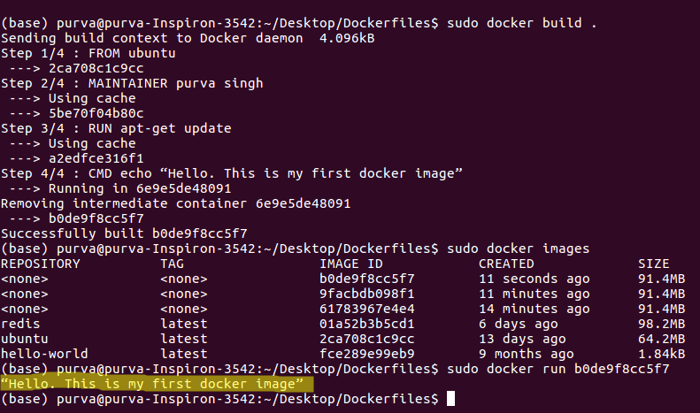

# Create your first dockerfile

## Step 1 : Create a file named Dockerfile
```
$cd /Desktop/
$mkdir Dockerfiles
$touch Dockerfile
```

## Step 2 : Add instructions in Dockerfile
* Import image from docker hub or create from scratch
* RUN instruction will be executed during building of image
* CMD imstruction will be executed when container is running.
* See [My_first_docker_file](https://github.com/purvasingh96/Extra-work/blob/master/Docker/My_first_dockerfile/Dockerfile) for entire code.

## Step 3 : Build dockerfile to create image
Execute the below command to build image-<br>
`sudo docker build .`
* Mention (.) after build if your pwd matches location of Dockerfile, else give full path.

## Step 4 : Run image to create container
Execute the below command to run image-<br>
`sudo docker run <image-ID>`

# Final Results
You should be able to see the instructions mentioned along with CMD, getting executed.<br>
</img>
