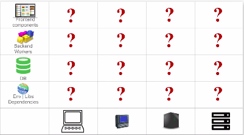
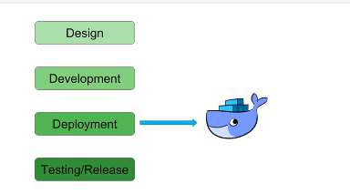
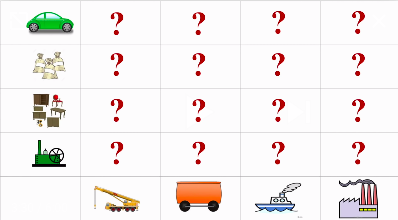
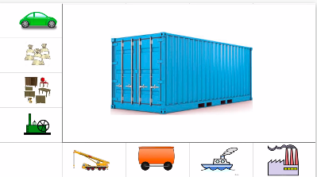
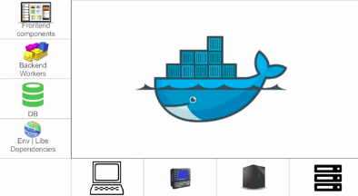

# What is docker?
Docker is world's leading software container platform. What does this mean?

## Problem faced in software industry
* A typical software engineer stack consists of -
  * Front-end components
  * Back-end components
  * Databases
  * Dependencies
 * A software engineer has to make sure that all the components of a software stack should work in different kinds of platform, which in-turn creates a **matrix from hell** as shown below -
 </img>

## Where does Docker come into picture?
* We have the following steps involved in a typical software development life-cycle. Docker comes at the **deployment stage.** 
</img>

## How does docker help to solve matrix from hell problem?
### Problems faced in Software Industry v/s Shipping Industry 
The problem faced by software engineers is very similar to what people from shipping industry faced a long time ago.  They had to ship various goods that belonged to different categories for ex. some were liquid, some were solid, some had different shapes and sizes etc. Their matrix from hell looked something like below -  
</img> 
## How did shipping industry solve their problem?
They switched to using **containers**, where goods can be manufactured as per standards. 
</img> 
## How did software engineers solve their problem?
Software engineers resorted to something similar, i.e. they used **docker containers**. Docker container allows a developer to package up an application with all the parts it needs, such as libraries and other dependencies and ship it out as one package. 
</img> 

