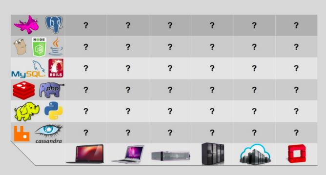
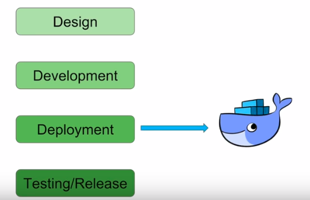

# What is docker?
Docker is world's leading software container platform. What does this mean?

## Problem faced in software industry
* A typical software engineer stack consists of -
  * Front-end components
  * Back-end components
  * Databases
  * Dependencies
 * A software engineer has to make sure that all the components of a software stack should work in different kinds of platform, which in-turn creates a **matrix from hell** as shown below -
 </img>

## Where does Docker come into picture?
* We have the following steps involved in a typical software development life-cycle. Docker comes at the **deployment stage.** 
</img>
